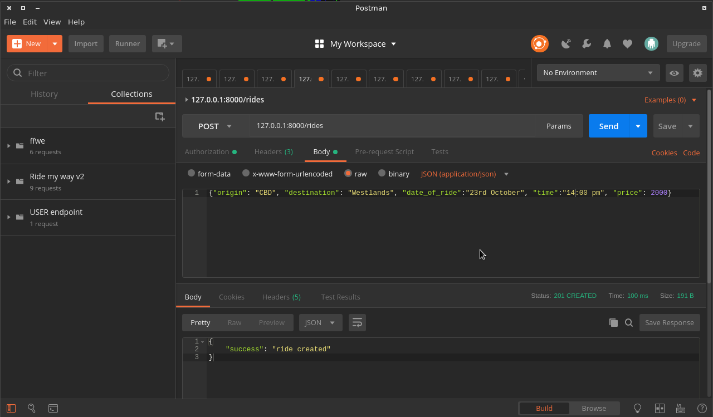

  

# RIDE-MY-WAY
 Ride-My-Way is a carpooling app that allows drivers to create ride offers and passengers to join available ride offers
 
## FEATURES
* Users can create accounts and Sign In
* Drivers can create rides
* Passengers can view available rides offers
* Passengers can request to join a ride
* Drivers can accept or reject requests to rides they created

## Technologies Used
* **Flask_restful** for api implementation
* **Flask_jwt_extended** for securing endpoints
* **Pytest** For tests
* **Flasgger** For documentation
* **Postgresql** For data persistence

## Getting started
### Requirements
To get started you need the following installed
 * Git
 * Python3

### Installation
1. To clone this repo run ``git clone https://github.com/Derrickkip/Ride-My-Way.git`` from your local terminal
2. `git checkout develop` to use the develop branch
3. Cd into the Ride-My-Way Folders
4. Create a virtual environment `python3 -m venv venv`
5. Activate the virtual environment `source venv/bin/activate`
6. Install requirements `pip install -r requirements.txt` This should install all dependancies including flask
7. Create a `.env` file in the root folder
8. Copy the contents of `.env.sample` into `.env`
9. Create a postgres database
9. Replace the urls in the `.env` with the database url you just created
10. In the terminal run `source .env` to export the settings
11. Now Run the app `python server.py`

### Usage
The api Implements a CRUD interface for rides using GET, POST, PUT and DELETE HTTP methods. The Api also has an auth route with signup and login

#### Available endpoints
| Method             | Endpoint                                       | Functionality
|:------------------:|:----------------------------------------------:|:--------------------------------------:|
 POST                | /api/v2/auth/signup                            | register a new account
 POST                | /api/v2/auth/login                             | login into application
 GET                 | /api/v2/rides                                  | get a list of all available ride offers
 GET                 | /api/v2/rides/<ride_id>                        | get ride with specified ride_id
 POST                | /api/v2/rides                                  | Create a new ride
 PUT                 | /api/v2/rides/ride_id>                         | Update ride with specified ride_id
 DELETE              | /api/v2/rides/<ride_id>                        | Delete ride with specified ride_id
 POST                | /api/v2/rides/<ride_id>/requests               | Make a request for ride with ride_id
 GET                 | /api/v2/rides/<ride_id>/requests               | Get all requests to ride with specified ride_id
 PUT                 | /api/v2/rides/<ride_id>/requests/<requests_id> |respond to a ride request with either accept or reject
 POST                | /api/v2/cars                                   | add car details
 GET                 | /api/v2/cars                                   | get users car
 PUT                 | /api/v2/cars                                   | Update users car
 DELETE              | /api/v2/cars                                   | Delete users car

The endpoints above can be tested using postman which offers a friendly and easy to use interface.
* **NOTE**  After logging in an access token is returned that needs to be passed in the header of all the other requests.
You have to update car details before creating a ride

Here is a screenshot from postman

### Testing
To run the tests `coverage run -m pytest`

### Documentation
[Heroku](https://derrick-ride-my-way.herokuapp.com/apidocs)

### Frontend
[Github pages](https://derrickkip.github.io/Ride-My-Way/)

## Author
* [Derrick Kipkirui](https://github.com/Derrickkip)

## Acknowledgements
* [Micah Oriaso](https://github.com/micahoriaso)
* My LFA's Millicent and Gidraf

## License
This project is licensed under the MIT License - see the [LICENSE.md](LICENSE) file for details
